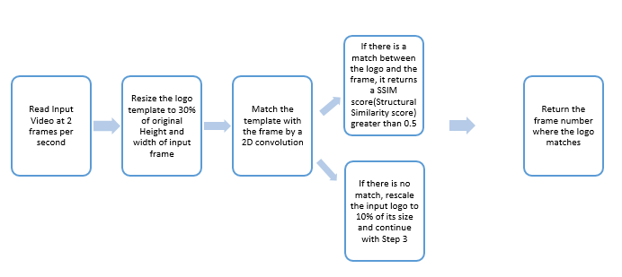

**Replay Detection:**

The replays present in any sports video file can be extracted using this module. (Assumption – Any logo would appear before the start of the replay and the end of the replay)

**Input** – Video File (one file/ multiple video files)

**Template** – Logo template (based on which the replay sections would be extracted)

**Output** – A CSV file containing the video file name, [Start, End] frame number of replay section

**Objective –** Matching the logo template with all the frames to extract the replay section

**Methodology:**

 

**Directory Structure:**

- data
  - Input
    - Video
      - Video\_1.mp4
      - Video\_2.mp4 etc.
    - Image
      - Logo1.png
      - Logo2.png
  - Output
    - Output Csv file generated after running the script
- generateHighlights.py
- replayExtraction.py
- markShots.py

**Scripts:**

- generateHighlights.py
- replayExtraction.py

**Packages Required:**

- Numpy – 1.17.3 
- Pandas – 0.25.1
- Opencv – 3.4.2
- imutils - 0.5.3
- Configparser – 4.0.2
- Scenedetect – 0.5.1.1

**Steps to Run the module:**

- Place the input video file/files in **./data/Input/Video/**
- Run the script **generateHighlights.py with a parameter Australian_Open" or "French_Open". Ex: python generateHighlights.py Australian_Open**
- Get the frame numbers where the replay section starts and ends as output in a csv file in the below path **./data/Output/**